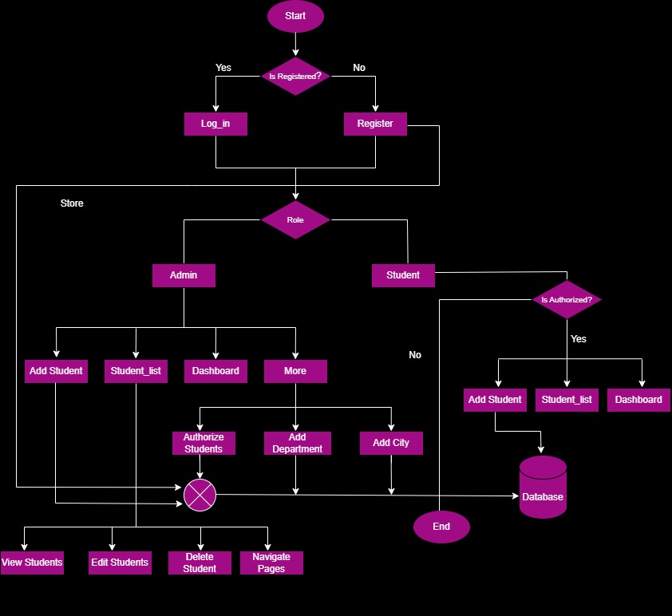

# Student Interests System

## Overview

The Student Interests System is designed to manage student information, including their interests, and provide insightful analytics through a dashboard. The system comprises three primary screens - Add Student, Students List View, and Dashboard.

# Application Flow

## Screens

### Add Student Screen

- Users can add new students with mandatory fields.
- Special dropdown for entering student interests.
- Dropdown is populated dynamically from the database.
- Users can add a new interest if not found in the dropdown.

### Students List View

- Paginated display of student data with sorting options.
- Page size dropdown to customize the number of rows displayed.
- Page navigator for easy navigation through the data.
- Actions for viewing, editing, and deleting each student record.

### Dashboard

The dashboard includes various widgets offering insights into student data:

- Top 5 and Bottom 5 Interests.
- Distinct interests count.
- Provincial distribution via a pie chart.
- Submission chart displaying daily student creations in the last 30 days.
- Age distribution bar chart.
- Department, degree, and gender distribution pie charts.
- Last 30 days and last 24 hours activity line charts.
- Students status grid showcasing current status counts.
- Most, least, and dead hours activity lists.

## Technologies Used

- **Frontend:** HTML, CSS, JavaScript.
- **Backend:** C# ,  MVC architecture
- **Database:** SQL.

